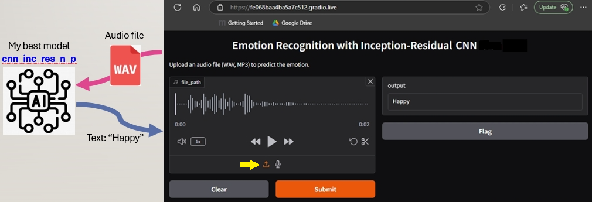
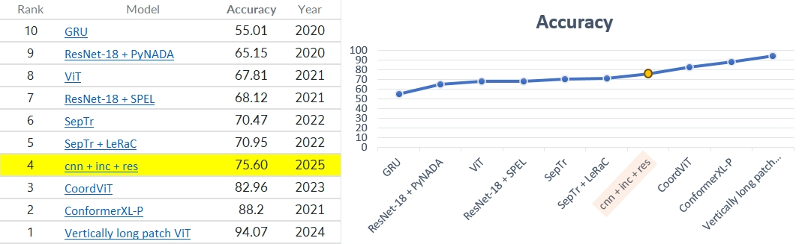

# Emotion Recognition App
A **deep-learning project** to identify emotions from vocal input (without using transcripts).  

**DL problem**: A multi-class classification task to detect emotions through speech pattern.  
Input to the model is raw audio data (speech). The model will learn to extract meaningful features from the audio data, such as tone, pitch, and intensity, and map them to specific emotions.  

**Practical use**  
A customer service application can incorporate emotion detection, assisting frontline operators to better engage with their customers.  

**Key Challenges**  
* **Variability in Speech**: Emotions can be expressed differently across individuals, accents, and languages.  
* **Noise in Audio**: Real-world audio data may contain background noise, which can affect model performance.  
* **Imbalanced Data**: Some emotions may be underrepresented in the dataset, leading to biased predictions.  

**Data Preprocessing**  
* **Feature extraction**: Spectrogram and Mel-Frequency Cepstral Coefficients (MFCCs)  
* **Data Augmentation**: Apply techniques like time-stretching, pitch-shifting, and adding noise to increase dataset diversity.  

**Model selection**
* Deep-learning models capable of handling Spatial and Temporal features
* Pre-trained models suitable for transfer-learning or fine-tuning

## Getting Started

1. Clone the repository: `git clone https://github.com/operats/emo-recog-app.git`
2. Navigate to the repository: `cd emo-recog-app`
3. Make the script executable: `chmod +x run.sh`
4. Run the app: `./run.sh`
5. In the terminal output, Gradio will provide a public URL for you to try out the demo.
6. Open a web browser and navigate to the gradio.live URL.

## Testing with Sample Audio Files

I've provided a directory `data/unseen_data` with some sample audio files (WAV format) to test the model. To use these files:

1. Make sure the `data/unseen_data` directory is in the same directory as the Gradio app.
2. In the Gradio app, click on the **upload icon** (_indicated by yellow arrow_) and select one of the WAV files from the `data/unseen_data` directory.
3. Click the "Submit" button to upload the file and get the predicted emotion.



Tiny note: Given the difficulty of the DL problem, don't be surprised by the **poor performance** you get from my demo app.  T_T  

## Folder structure
```
emo-recog-app/
├── app/
│   ├── __init__.py
│   ├── main.py
│   ├── model.py
│   └── preprocessing.py
├── data/
│   └── unseen_data/
│       ├── audio_file1.wav
│       ├── audio_file2.wav
│       └── ...
├── models/
│   └── trained_model_cnn_inc_res_nse_p-sh.h5
├── .gitignore
├── README.md
├── requirements.txt
└── run.sh
```
## Data samples for demo
Note that the sample test files I included in `data/unseen_data` are just a few selected wav files from the CREMA-D audio dataset for the purpose of demonstrating the model's capability of recognising emotions from sound.

**CREMA-D dataset**  
The CREMA-D dataset is a collection of 7,442 audio-visual clips from 91 actors, featuring diverse ethnic backgrounds, ages (20-74), and emotions.  
My models are trained on this dataset.  
**Emotions**: The dataset includes six basic emotional states - anger, disgust, fear, happiness, neutral, and sadness.  
**Emotion Intensity**: Each clip has one of four emotion intensity levels: low, medium, high, or unspecified.  
**Actors**: 48 male and 43 female actors participated, speaking 12 different sentences.  
**Ratings**: Each clip was rated by multiple participants (over 7 ratings per clip) based on audio, video, or audio-visual presentations.  
**Data Structure**: The dataset contains audio files in WAV format, with a sampling rate of 16,000 Hz and 16-bit depth.  
**Usage**: CREMA-D is suitable for emotion recognition tasks, particularly in audio-visual contexts.  
**License**: The dataset is licensed under the Open Data Commons Open Database License (ODbL) v1.0.  
CREMA-D is widely used for research purposes and is available on various platforms, including GitHub, Hugging Face, and TensorFlow Datasets.  


## Model details
For this experiment, I trained many different types of models, with and without data augmentation, to find out which type would perform the best.  These are the models I tried:  
1. Simple CNN, Deeper CNN
2. Simple RNN, Bi-directional RNN
3. Data augmentation (Add noise, time-shift, pitch-shift)
4. Hybrid CNN+RNN
5. Bi-dir RNN + Attention
6. CNN + Inception + Residual
7. CNN + Inception + Residual + Attention
8. Transfer Learning (VGGish)
9. Fine-tuning (Wav2Vec)  

The final model with the best performance is:  **CNN+Inc+Res + noise + pitch-shift** 

## Metrics used
To measure my deep-learning model's performance, I used:
* Accuracy
* Precision
* Recall
* F1_score

## My best model's performance
My best model is `CNN enhanced with inception blocks and residual blocks`, trained on `data augmented with noise and pitch-shift`.  
**Accuracy = 75.60%**  
It may not seem high, but benchmarked against other models published by people worldwide, I actually ranked **4th**!!  


Data obtained from: 
**Leaderboard at PapersWithCode**  
https://paperswithcode.com/sota/speech-emotion-recognition-on-crema-d

